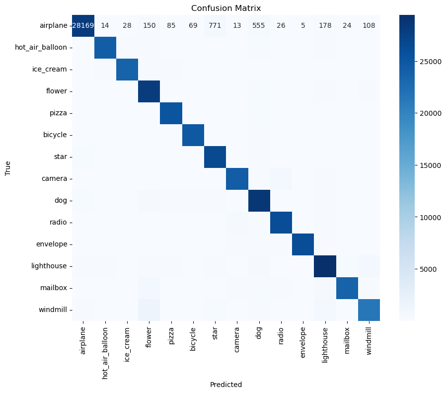
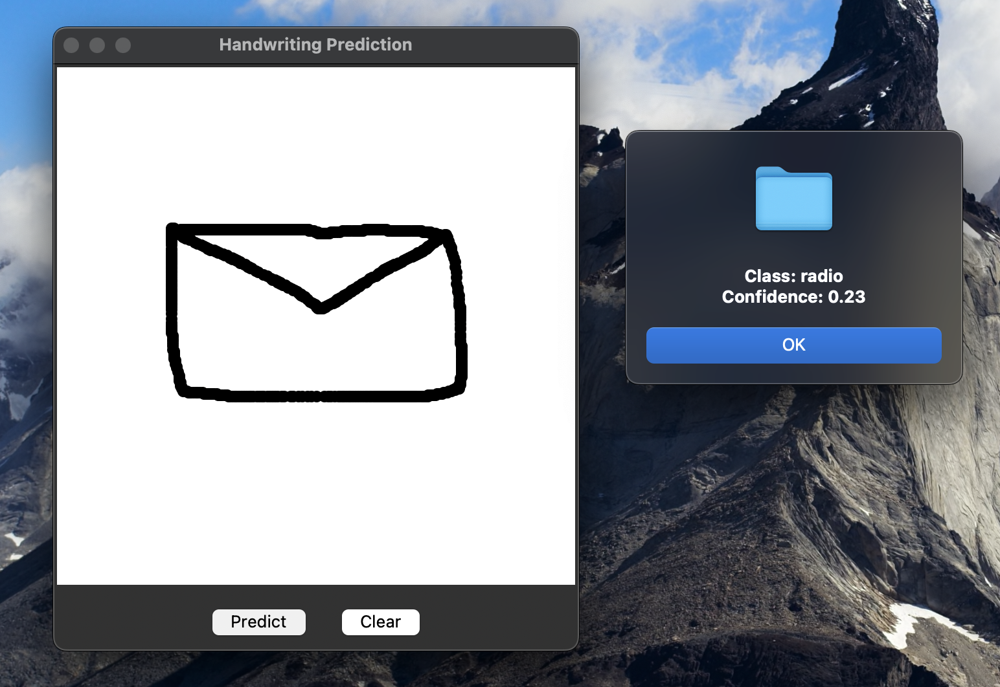

# Real-Time Sketch Classification with a Convolutional Neural Network

This project is a recreation of Google's "Quick, Draw!" game, where a Convolutional Neural Network (CNN) is trained to classify hand-drawn sketches in real-time. The application includes a Jupyter Notebook for data preprocessing and model training, and a Tkinter-based GUI for users to draw and get live predictions.

## Table of Contents
- [Project Overview](#project-overview)
- [Dataset](#dataset)
- [Model Architecture](#model-architecture)
- [Performance](#performance)
- [Real-Time Prediction GUI](#real-time-prediction-gui)
- [Challenges](#challenges)
- [Setup and Usage](#setup-and-usage)
- [File Structure](#file-structure)

## Project Overview

The core of this project is a CNN model built with TensorFlow and Keras. The model is trained on a subset of the "Quick, Draw!" dataset to recognize sketches across 14 different categories. The project demonstrates a full machine learning workflow: data loading, preprocessing, model training, evaluation, and deployment in a simple graphical user interface.

## Dataset

The project uses a curated subset of the vast [Google Quick, Draw! Dataset](https://github.com/googlecreativelab/quickdraw-dataset). The raw data (`.npy` files) is **not** included in this repository and should be downloaded separately if you wish to re-train the model.

The 14 categories used for this project are:
- Airplane
- Bicycle
- Camera
- Dog
- Envelope
- Flower
- Hot air balloon
- Ice cream
- Lighthouse
- Mailbox
- Pizza
- Radio
- Star
- Windmill

## Model Architecture

The final model is a Sequential CNN designed to balance performance and efficiency.

-   **Convolutional Layers**: Two `Conv2D` layers with (5x5) filters (32 and 64 filters, respectively) and ReLU activation functions to extract features from the sketches.
-   **Pooling Layers**: Two `MaxPooling2D` layers to downsample the feature maps and reduce computational load.
-   **Flatten Layer**: A `Flatten` layer to convert the 2D feature maps into a 1D vector.
-   **Dense Layers**: Two `Dense` layers (512 and 128 neurons) with ReLU activation for classification.
-   **Dropout Layers**: Two `Dropout` layers with a rate of 0.6 to prevent overfitting.
-   **Output Layer**: A `Dense` layer with a softmax activation function to output a probability distribution across the 14 classes.

## Performance

The refined model was trained for 3 epochs and achieved the following performance on the validation set:
-   **Validation Accuracy**: 95%
-   **Validation Loss**: 0.19
-   **Total Training Time**: Approximately 24 minutes.

### Classification Report

```
                 precision    recall  f1-score   support

       airplane       0.95      0.93      0.94     30195
hot_air_balloon       0.97      0.96      0.97     25164
      ice_cream       0.97      0.96      0.97     24585
         flower       0.89      0.96      0.93     29090
          pizza       0.95      0.97      0.96     26042
        bicycle       0.97      0.98      0.98     25299
           star       0.94      0.97      0.95     27514
         camera       0.96      0.94      0.95     25748
            dog       0.90      0.94      0.92     30289
          radio       0.95      0.95      0.95     27436
       envelope       0.99      0.96      0.98     27163
     lighthouse       0.93      0.92      0.92     32035
        mailbox       0.97      0.91      0.94     25861
       windmill       0.93      0.88      0.90     24292

       accuracy                           0.95    380713
      macro avg       0.95      0.95      0.95    380713
   weighted avg       0.95      0.95      0.95    380713
```

### Confusion Matrix
 

## Real-Time Prediction GUI

A simple graphical user interface was created using Python's Tkinter library. It provides a canvas for users to draw on and buttons to either predict the drawing or clear the canvas.



## Challenges

While the model performs well on the validation data, its accuracy on live, user-drawn sketches is lower. This is likely due to the mismatch between the heavily preprocessed training data and the "noisy" nature of real-time drawings (e.g., variations in stroke thickness, drawing style, and scale).

## Setup and Usage

To run this project, follow these steps:

1.  **Prerequisites:**
    -   Ensure you have Python 3 and Git installed.

2.  **Clone the Repository:**
    ```bash
    git clone [https://github.com/EthanSterling04/sketch-classification.git](https://github.com/EthanSterling04/sketch-classification.git)
    cd sketch-classification
    ```

3.  **Install Dependencies:**
    ```bash
    pip install tensorflow numpy matplotlib seaborn pillow
    ```

4.  **Run the Real-Time Application:**
    -   The final cells of the notebook contain the code for the Tkinter application.
    -  Run these cells to launch the application. It will use the pre-trained `cnn_model.h5` that is included in the repository.
    -   Draw on the canvas and click "Predict" to see the model's guess.

5. **Re-training the Model (Optional):**
    -   To re-train the model from scratch, first download the raw data from the [Google Quick, Draw! Dataset](https://github.com/googlecreativelab/quickdraw-dataset).
    -   Create a `data/` directory in the project root and place the downloaded `.npy` files there.
    -   Run the notebook cells sequentially from the beginning. This will overwrite the existing `cnn_model.h5` file.

## File Structure

-   `.gitignore`: Specifies files and directories to be ignored by Git.
-   `AI_Project.ipynb`: Jupyter Notebook for the entire workflow.
-   `CS_399_AI_Project.pdf`: The detailed project report.
-   `Recreating Google’s Quick, Draw!.pdf`: The project presentation slides.
-   `data/`: **(Ignored by Git)** Directory for the raw `.npy` dataset files.
-   `processed_data/`: Directory for processed data and the model.
    -   `cnn_model.h5`: The pre-trained model.
    -   `*.npy`: **(Ignored by Git)** Processed data files generated by the notebook.

